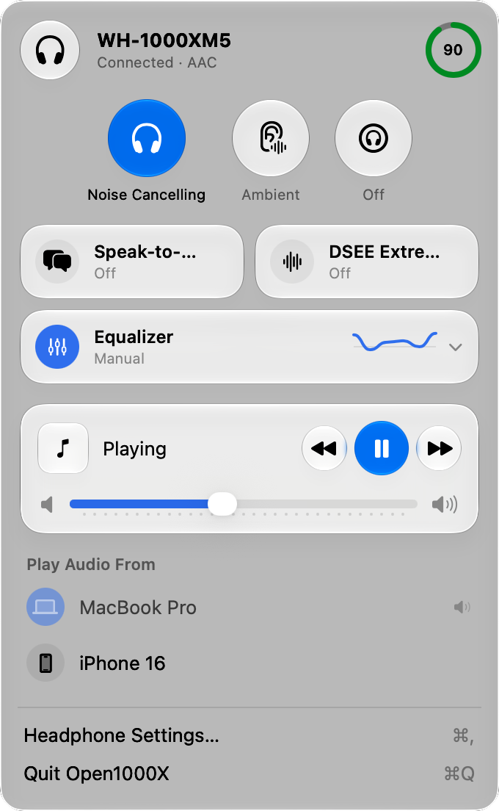

> **Early.** Built and tested against one headset, a WH-1000XM5 on firmware 2.4.1. Some settings are implemented but have never been written to real hardware. The [parity table](#feature-parity-with-sound-connect) says which.

<div align="center">
  <br>
  <h1>Open1000X</h1>
  <sub>Sound Connect for the Mac, minus the phone</sub>
  <br>
  <br>
</div>

Open1000X is a native macOS menu bar app for Sony 1000X headphones. It replaces Sony Sound Connect on the Mac by talking to the headset directly over Bluetooth, using Sony's own MDR protocol. There's no phone, no account and no cloud involved.

- 🎧 Noise Cancelling, Ambient Sound (1–20) and Focus on Voice, one click from the menu bar
- 🎚️ Sony's EQ presets, a 5-band + Clear Bass editor, and two presets of its own (Punch, Clarity)
- 🗣️ Speak-to-Chat, DSEE Extreme, NC/AMB button cycle, Quick Access, touch panel
- 📱 Multipoint: see both connected devices and move audio between them
- 🔋 Battery and noise mode in the menu bar, opens at login
- 🧩 The UI is built from the function list the headset reports, so it only shows what your model supports
- ⌨️ `mdrctl`, a CLI that does everything the app does (and prints every frame if you ask)

<p align="center">
  <picture>
    <source media="(prefers-color-scheme: dark)" srcset="assets/menu-dark.png">
    
  </picture>
</p>

Developed and tested against a **WH-1000XM5 (firmware 2.4.1)** on macOS 27. Other MDR v2 headsets (WH-1000XM6, WF-1000XM5, LinkBuds…) should mostly work, but they are untested.

## Quick Start

You need macOS 26 or later, Xcode 26 (Swift 6.2), and headphones already paired in System Settings → Bluetooth.

```sh
git clone https://github.com/gergogyulai/open1000x.git
cd open1000x
./scripts/build-app.sh          # → build/Open1000X.app (ad-hoc signed)
open build/Open1000X.app        # macOS asks for Bluetooth access on first launch
```

It lives in the menu bar only, with no Dock icon. **Headphone Settings…** (⌘,) opens the full settings window.

## CLI

```sh
swift build && .build/debug/mdrctl status
```

```
model                  WH-1000XM5  fw 2.4.1
battery                93%  notCharging
codec                  AAC
noise control          Noise Cancelling  ambient 20
NC/AMB button          Noise Cancelling ↔ Ambient
speak-to-chat          off  Auto, Standard (about 15 s)
equalizer              Manual  [8, -2, 3, 4, 0, 9]
DSEE                   DSEE Extreme off
connection             Prioritize Sound Quality
...
```

Run `mdrctl` with no arguments for the full command list: noise control, EQ, Speak-to-Chat, playback, multipoint, raw payloads, and `listen` for headset notifications.

| Debugging | What it does |
|---|---|
| `mdrctl --trace <command>` | Prints every frame sent and received |
| `OPEN1000X_TRACE=1 build/Open1000X.app/Contents/MacOS/Open1000X` | Same, for the app |
| `OPEN1000X_SNAPSHOT=<dir> build/Open1000X.app/Contents/MacOS/Open1000X` | Screenshots the popover and every settings pane (light + dark), then quits |
| `DEMO=1 ./scripts/build-app.sh` | Builds a demo variant into `build/demo/` that shows paired devices as "MacBook Pro" and "iPhone 16", for screenshots. The masking is compiled in only for this build |
| `swift test` | Framing, escaping and parsing tests (no headset needed) |

## Feature parity with Sound Connect

✅ = verified on the XM5 by reading back after a write. ☑️ = implemented, read path verified, write not exercised. The write was held back because it disconnects or re-pairs devices.

| Feature | Status |
|---|---|
| Battery, charging state, codec, DSEE activity | ✅ |
| Noise Cancelling / Ambient Sound / Off, ambient level 1–20, Focus on Voice | ✅ |
| NC/AMB button cycle | ✅ |
| Speak-to-Chat on/off, sensitivity, end timer | ✅ |
| Equalizer presets, custom 5 bands + Clear Bass | ✅ |
| DSEE Extreme | ✅ |
| Headset confirmation prompts (e.g. touch panel, multipoint) | ✅ |
| Touch sensor control panel | ✅ (prompt flow verified, change declined) |
| Volume, play/pause/next/previous, now playing | ☑️ |
| Connection quality (sound vs. stable) | ☑️ |
| Voice assistant selection | ☑️ |
| Quick Access (double/triple tap) | ☑️ |
| Pause when taken off, automatic power off | ☑️ |
| Voice guidance on/off and language | ☑️ |
| Multipoint on/off, paired device list, switch audio source, connect/disconnect/unpair, pairing mode, auto source switch | ☑️ |
| Sound pressure (safe listening) | ☑️ |
| Power off, reset settings, factory reset | ☑️ |

### Not implemented

- **Adaptive Sound Control.** Sound Connect uses the phone's motion and location sensors to decide *when* to push settings. The headset side (`SENSE` commands) is documented in `Protocol.swift`. A Mac version would need its own triggers, such as Wi-Fi network or Focus mode.
- **Firmware updates.** These need Sony's update servers and a proprietary transfer protocol, and getting it wrong can brick the headset.
- **360 Reality Audio, "Find your equalizer", listening history.** These are phone-app services, not headset settings.
- **Quick Access service names beyond Spotify Tap.** The XM5 offers IDs 2 and 5 too; they are shown by number.

## Project Structure

```
open1000x/
├── Sources/
│   ├── MDRKit/                 # the protocol, usable on its own
│   │   ├── Framing.swift       # frame encoding, escaping, checksum, stream reassembly
│   │   ├── Connection.swift    # IOBluetooth RFCOMM channel, ACK/sequence handling, retransmit, request/reply
│   │   ├── Protocol.swift      # protocol vocabulary
│   │   ├── Commands.swift      # payload builders
│   │   ├── Headphones.swift    # observable headset model: initial sync, replies, notifications, setters
│   │   └── DeviceManager.swift # finds paired Sony headsets, follows connect/disconnect
│   ├── Open1000X/              # SwiftUI menu bar popover and settings window
│   └── mdrctl/                 # command-line client
├── Tests/                      # MDRKit tests
├── scripts/build-app.sh        # builds and ad-hoc signs the .app
├── research/                   # the original Python/Bun protocol research
└── site/                       # product site (Astro)
```

## Contribute

This is a personal project, built in the open. Ideas, issues, and PRs are welcome.

If you have a different Sony headset, the most useful thing you can do is run `mdrctl status` and open an issue with the output (and what looks wrong).

## Credits

The protocol knowledge comes from [Gadgetbridge](https://codeberg.org/Freeyourgadget/Gadgetbridge) and [mos9527/SonyHeadphonesClient](https://github.com/mos9527/SonyHeadphonesClient) (MIT). Not affiliated with Sony.

## License

[MIT](LICENSE)
